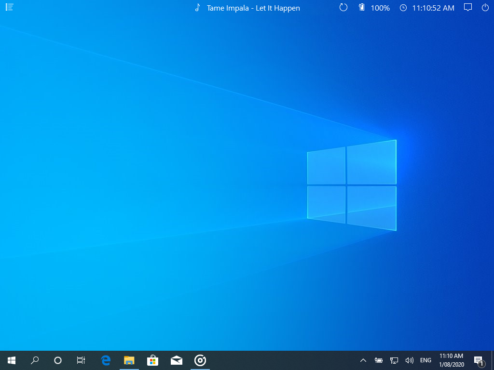

# {{ $page.title }}
> 07-02-2021

This project was inspired by an existing project called [Selene](https://github.com/JamesDearlove/Selene), something my friend [James Dearlove](https://jamesdearlove.com/) was developing. James was developing Selene using .NET and utilising the Windows 10 Runtime API. Because of this Selene will only work for Windows 10 1809 (Build 17763) or newer.

Because of this, and also because I really like C++, I had a thought... `What if Selene was C++ now` this thought lead me to delve into the depths of the Win32 API and regret starting this project.

## 0x00: Why do this project

When James started working on Selene I thought it looked absolutely amazing, the design was slick and with the right desktop background it made Windows look like something special. Yes you can do similar stuff with [Rainmeter](https://www.rainmeter.net/) but James made this himself. If you didn't look at the [Selene](https://github.com/JamesDearlove/Selene) repo, its essentially a thin bar at the top of your display with the middle section showing what song you are currently listening along with a pop out media controller. Other features included showing your battery level, time and some miscellaneous buttons all with clean looking glyphs.



## 0x01: Starting this project

I started this project with a name, Helios. I picked this name as Selene is the Greek Goddess of the Moon while Helios is the Greek God of the Sun. James figured I would name it that. After naming it I was able to start an empty C++ Visual Studios Project. To be able to do this project, I needed to do 3 main things:
- Something to render with
- Render fonts
- Register the window as a taskbar using the win32

For the renderer I decided to use a basic [SDL](https://libsdl.org/index.php) setup. Create a window, Have a buffer to manually write to, push the buffer to the window. I will go over this more in my Greyhound project, I'm planning on integrating that into this when it gets more developed. For rendering fonts I did use the [SDL_TTF](https://www.libsdl.org/projects/SDL_ttf/) library as it works nicely with SDL but I did have to write a reasource manager to handle using mutliple fonts at different sizes as I wanted to minimise the amount of times the program had to read a font file.

Rendering the glyphs that James used in Selene had me stumpped for a while, as I thought it had something to do with the other font rendering calls avaliable with SDL_ttf like `TTF_RenderUTF8()`, `TTF_RenderUNICODE()`, `TTF_RenderGlyph()`. Turns out the glyphs that Microsoft uses for their stuff is its own font called [Segoe MDL2](https://docs.microsoft.com/en-us/windows/uwp/design/style/segoe-ui-symbol-font) which if you have a windows machine you can find it in the `C:/Windows/Font` directory.

Now that I have the main rendering part down pack all I need to do now is the hard part... reading the Microsoft Win32 API Documentation.

## 0x02: Registering an App Bar

This was relatively easy to do, but was incredibly painful to try and figure out. Alot of the documentation seemed to really want you to use C# these days and also the Runtime library which are both things I didn't want to use. The Runtime library is what made Selene stuck with the Windows 10 1809 (Build 17763) or newer limitation.

I eventually caved in and looked at James' code to see what he did. He used an external library called [WpfAppBar](https://github.com/PhilipRieck/WpfAppBar), which after reading lead me to Windows Shellapi.h but more specifically the [SHAppBarMessage](https://docs.microsoft.com/en-us/windows/win32/api/shellapi/nf-shellapi-shappbarmessage) call. 

This was a great discovery for the project as all I have to do now is use `SHAppBarMessage()` to register an `appbar` then I would be able to set the position and size of it, though check to see if the space is ooccupied and if it is occupied then it would try and get the next best position). The checking space occupied thing explained why when you were able to run selene more than once they dont all go to the top but stack, but if you force them all to go to the top Windows will really bug out.

Below is an the code required to register the `appbar` as well as another function to position and size it.

```C
// The application needs to be registered as an App Bar to be used like a seperate task bar
bool RegisterAppBar(SDL_Window* window, bool register_state)
{
    // Set the windows message callback to an unreserved number
    app_bar_callback = (WM_USER + 0x01);

    data = new APPBARDATA();

    // Set basics of the appbar data
    data->cbSize = sizeof(APPBARDATA);

    // Set window handle
    data->hWnd = GetWindowHandle(window);
    if (data->hWnd == nullptr) return false;

    // Register the App Bar
    if (register_state) {
        // Set the App Bar&#x27;s winows message callback
        data->uCallbackMessage = app_bar_callback;

        // Register the app bar, return false if it failed
        if (!SHAppBarMessage(ABM_NEW, data)) return false;

        // Set stats
        app_bar_registered = true;
    }
    else {
        // Un-Register the App Bar from the windows shell API
        SHAppBarMessage(ABM_REMOVE, data);
        app_bar_registered = false;
    }

    return true;
}

// Set a registered App Bar to be fixed to a particular side of the screen
void PASCAL AppBarSetPos(SDL_Window* window, int desired_size = 30)
{
    // Error Checking
    if (app_bar_registered == false) {
        if (!RegisterAppBar(window, true)) return;
    }

    data->rc = size;
    data->uEdge = ABE_TOP;
    
    // Set window handle
    data->hWnd = GetWindowHandle(window);
    if (data->hWnd == nullptr) return;

    // Set the window to the specific edge
    height = desired_size;
    data->rc.left = 0;
    data->rc.right = GetSystemMetrics(SM_CXSCREEN);

    // Check if the size and position is valid
    SHAppBarMessage(ABM_QUERYPOS, data);

    // Adjust window size to fit the appropriate edge
    data->rc.bottom = data->rc.top + height;

    // Check the window rect bound with the system
    SHAppBarMessage(ABM_SETPOS, data);

    // Set the winow
    MoveWindow(data->hWnd, data->rc.left, 
                           data->rc.top, 
                           data->rc.right - data->rc.left, 
                           data->rc.bottom - data->rc.top, true);
}
```

## 0x03: Fetching music

Now that I had the `appbar` registered and the window positioned where I wanted it, it was time to get the active music. James used the Runtime to get all active media which would have been amazing, but for Helios, Spotify will be its only location for music (for now). Spotify is very friendly and helps with this as the window name for spotify changes to the current playing song.

So what I needed to do was to find the Spotify process and get the window name. I had to go through multiple different iterations of process searching because of a lot of memory leak issues, at one point I was using +100MB of memory every couple of seconds. But it's now fixed and works smoothly. Below is the code I used:

```C
const char* current_search;

const char* Helios::Process::GetWindowNameByProcessName(const char* name)
{
    // Set the process to search
    current_search = name;

    // Get the window handle for the target process
    HWND desired_hWnd = nullptr;
    bool search = EnumWindows(EnumWindowCallback, (LPARAM)(&desired_hWnd));
    if (search) return "";

    // Get the window title from the window handle
    int length = GetWindowTextLength(desired_hWnd);
    char* buffer = (char*)malloc((++length) * sizeof(char));
    GetWindowTextA(desired_hWnd, buffer, length + 1);
    
    // Return the window name
    return buffer;
}

BOOL Helios::Process::EnumWindowCallback(HWND hWnd, LPARAM lparam)
{
    // Cull processes that are definetly not the target
    int length = GetWindowTextLength(hWnd);
    if (IsWindowVisible(hWnd) && length != 0) {
        // Get the process ID
        DWORD pid;
        DWORD actual_proc_id = GetWindowThreadProcessId(hWnd, &pid);

        // Check if the process name is the target process
        if (strstr(ProcessIdToName(pid), current_search)) {
            // Pass a reference back through the LPARAM and terminate the search
            // to save on compute cycles
            *((HWND*)(lparam)) = hWnd;
            return FALSE;
        }
    }
    
    // Continue search
    return TRUE;
}

const char* Helios::Process::ProcessIdToName(DWORD pid)
{
    // Get a handle for the process to read
    CHAR process_name[MAX_PATH] = "";
    HANDLE handle = OpenProcess(PROCESS_QUERY_INFORMATION | PROCESS_VM_READ, FALSE, pid);

    HMODULE module_handle;
    DWORD required_bytes_to_store_lphModule;

    // Check if process handle was created
    if (NULL != handle) {
        // Get the module handles, check if it failed
        if (EnumProcessModules(handle, &module_handle, sizeof(module_handle), 
                               &required_bytes_to_store_lphModule)) {

            // Get the process name
            GetModuleBaseNameA(handle, module_handle, process_name, 
                               sizeof(process_name) / sizeof(CHAR));
        }
    }
    // Close handle to prevent leak
    CloseHandle(handle);

    return process_name;
}
```

For an explanation I had to use the `winuser.h` library to to get all the top-level windows on the screen, convert the `PIDs` (Process Ids) to the process name using `psapi.h` to search for the window with the target process which returned the `HWND` which allowed me to use `GetWindowTextA()` to get the window name.

<MyFooter/>