# Dear Olivia

This is an understatement but, I love you. I can only say it as an 
understatement because there are no words I have that can describe how much I 
love you, or how much you mean to me. Every time I try to write these I never 
feel that I have truly expressed my love for you. You are the love of my life, 
even though you are in a different state my mind still plays tricks on me make 
it feel like you are actually here with me. Sometimes these feelings are nice 
but others are mean, for example rolling over when I'm a sleep and scare waking 
myself up worried that I might have accidently slapped you in the face (this is 
on of the mean ones). Other times when I successfully do something at work or 
anywhere I can imaging hearing you say `Good job baby` before kissing me on 
the cheek.

Anyway lets get back on topic, lets reminisce.

## 2018

March-April 2018, the month I decided to message you to see how you were going. 
I have no idea why I decided to, but it was one of the biggest highlights in my 
life. Without this single thing happening we wouldn't be together now (maybe, I 
don't know). I occasionally think back to the first couple of weeks we and how 
weird I was, and how shy you were. It was adorable. I'm so lucky that my 
craziness didn't drive you away. Remember how you didn't want to do long 
distance yet I was able to convince you, do you regret it? XD. I don't. 

I believe from memory you said yes on the `10th April 2018`. We counted months 
we were together for a couple months after this date, now we are only couting 
years. But in all honesty, it's felt like there wasn't a time we weren't 
together. We video called everyday and ingrained each other into our daily lives
and into each others families. The first time we physically saw each other was 
up here, you stayed with your Auntie and I had to come pick you up and take you
places to go on dates. The second physical time was when I went to Melbourne for 
my birthday. I spent my 18th birthday night wishing I was withyou but instead I 
arrived late, when everything was closing and I had a pretty bad/boring night 
with Nana & Pa. But the following day we got to have dinner together at 
`Big Pig Little Pig` along with Andrea, Nana and Pa. That was a goodnight, 
being able to spend time with each other. The rest of the trip was a blur. The 
next visit I stayed at you place, and it wasn't much later when we finally 
got to sleep with each other.

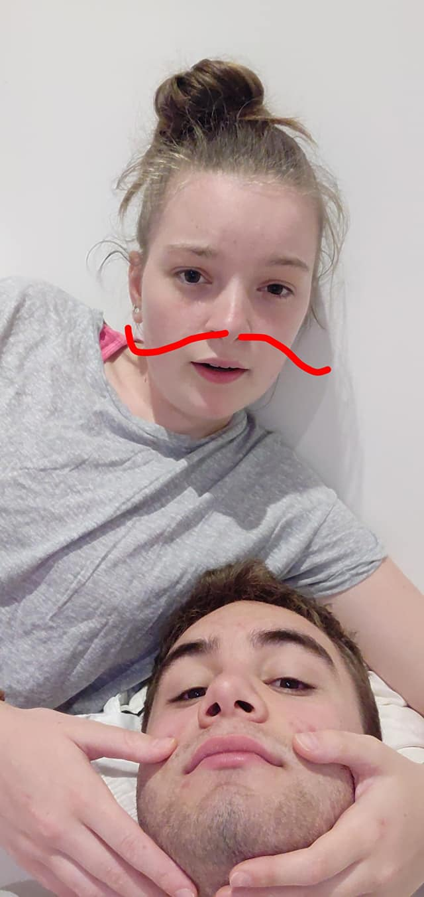

I also remember when you were the one with the medical problems, you have me 
some really good frights while you were at it. Man have the times changed with
that. But I'm glad I'm the one that has to deal with the physical pain instead 
of you as that was the main thing I wish I could have taken away from you during
your painful times.

> Quick note, our bucket list was first created on May 8th, 2018

### Valedictory

I remember your Val, it was when you kept telling me to bugger off when you were
getting your make up done. But before that I got to watch your graduation in 
person and meet your highschool friends, oh and teachers. I can never remember 
the grad video song off the top of my head. But everytime I hear it in the 
office I always remember you grad when I do.

I think the Valedictory night was probably when I first started getting symptoms
of my UC. Which does explain how I was feeling that night, but anyway it was a
fun night.

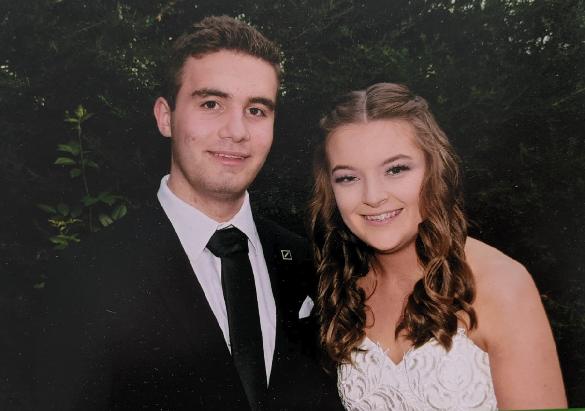

### Noosa

Remember Noosa, we had a great time together there. We were sleeping in seperate
rooms at the start but ended up moving together after some convincing to 
Claudia. I remember getting you the Bikini that you still have today with you. I
remember all the Ben and Jerries we had together as well. Trying to teach you to
surf. Proving my phone had a better camera. Casual walks we did, and some other 
new things. Oh yeah and also this...

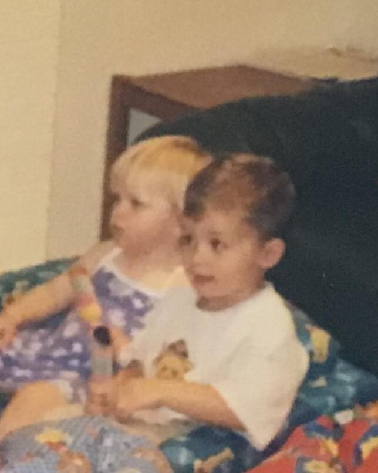
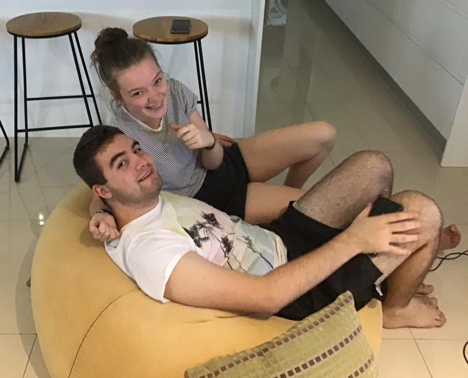

## 2019

This year was a hard year for me medically and you mentally. We both started uni
but me constantly getting dicked around at hospitals and put through many 
medications was difficult. But we got through it, a year of hell that had a 
sequal in `2020`. 

The good thing was that we got to see each other the most this year. We did have
our fair share of fun and do a whole bunch of stuff. You also got to meet my 
friends this year, we went and saw a movie at Robina all together.

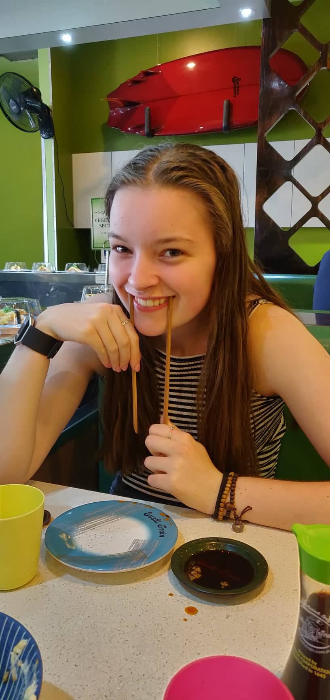

There was also a lot of shenanigans as you were apart of my friend group chat. 
Oh and taking the piss out of Nat and Gordie.

### Olivia's 18th

You had your 18th this year and I was able to spend it with you, I might have 
given you too much to drink. Lots of vodka, lemonade, tequila. I still remember
having to hose out the pavement after you hurled all over. It was adorable, I 
made sure I took care of you and got you to bed safely and introduced you to the
holy bucket, may it be our saviour and protector forever.

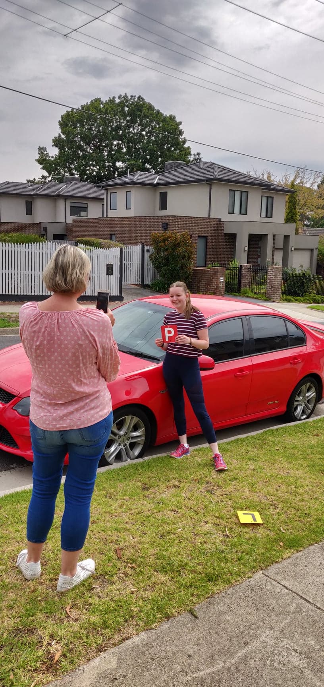

### Wedding

No unfortunately it wasn't ours. But it was Karen and Steve's. You stayed with 
me and we met your parents there. You slept in the car on the drive there. I 
met most of your family here, it was alot of fun and we ended up staying at a 
hotel with your parents before going home. Oh yeah remember when the hair 
dresser screwed up doing you hair, good fun. You look really good in curls.

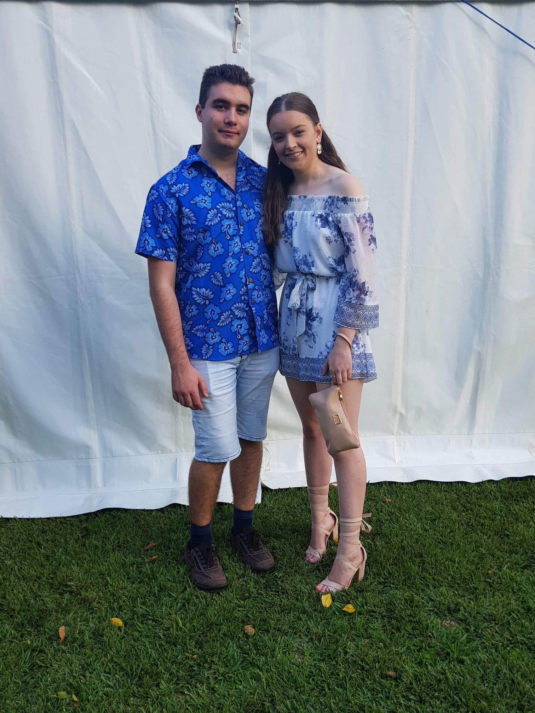

Later in this trip our families met together at the CBD for the first time. And 
we tried going clubbing in Burliegh which went didn't go too well and was 
another night of me looking after you.

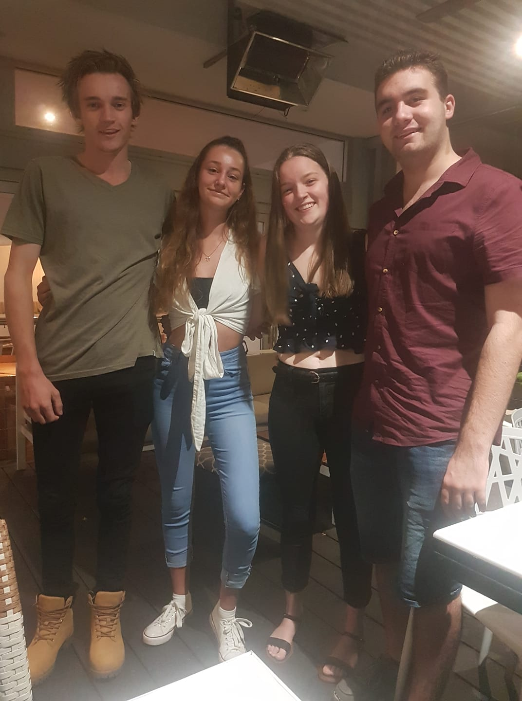

### Funeral

I was really contemplating putting this in here, but our history main big events
wouldn't be complete without this. This was a hard time for you and your family 
along with my by extension. I really connected with your family during this 
time, it's also probably one of the reasons that I have been put in the good 
books all round in your family. Plus I was glad that I was able to physically be
there with you during this really really hard time.

### Christmas & New Years

I got to spend the end of Christmas alone with you which was fantastic. We also
followed up with new years during a dangerous time of big wild fires. But we 
managed to do pretty well. We drank alot then. So did everyone else. But it was
a good night. Oh and there was bowling somewhere around here as well.

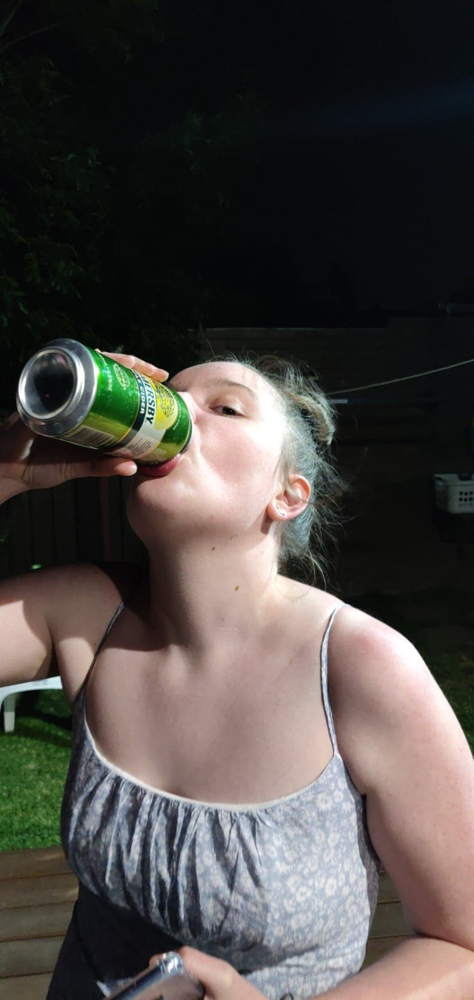

## 2020

This was a hard year, but at least we made the most of it with you here for 
Christmas and New Years. But the biggest highlight was definitely the Japan 
Trip. Oh and I also made it to your birthday which was a huge bonus.

### Japan

This was our first ever trip just together, and it wasn't a little trip. This 
time was something special. Exploring exotic places in Tokyo before going to 
Nozawa and experiencing the easten life during winter. Skiing with you was fun 
but I also just liked being with you and chilling in the landscape. Oh and the 
snow monkeys.

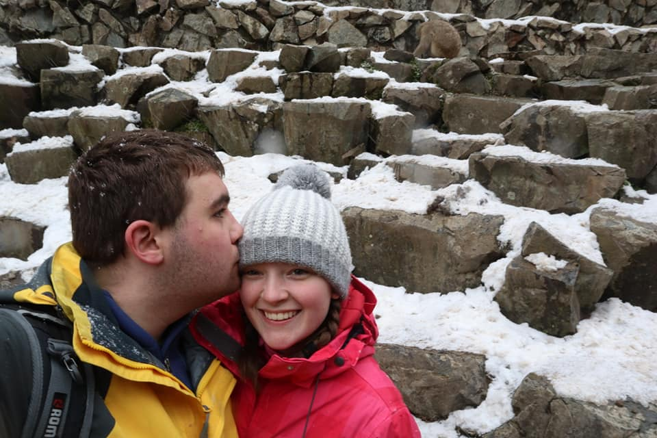

This was an amazing experience to have with you, and one of the bonuses was that
we didn't rip each others heads off. Thats gotta be a couples milestone 
somewhere.

### Disneyland

No I didn't forget about this, being able to bring you to a place you always 
dreamed about going to was a joy in its self. We did alot of walking this day, 
went on a bunch of rides and even "scary" rides as well. There was also a lot of
not understanding what the fuck everyone was saying, but that be semantics. Also
we might need to go to another one thats english so the language barier isn't 
so heavy.

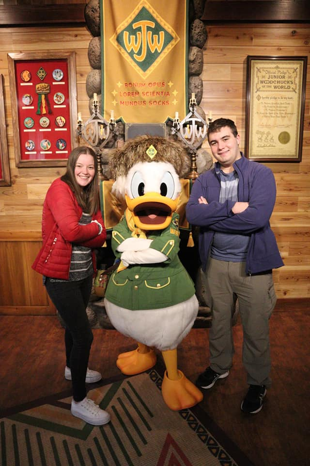

### Olivia's 19th

It was good to be able to spend time with you and enjoy celerbrating your 19th 
birthday. Especially before the massive event of covid happening. We were really
lucky with this one, I just regret that I wasn't able to spend as much time with
you on this trip before the big gap.

### Christmas

It had been over 8 months of us being apart. But we were able to catch up as 
though we were never apart. Even though there was a bit of awkwardness of being
tired, always on our phones as physically being together again just felt strange
after being a virtual image for the longest period of time we have ever been 
apart. But we made it and my love of you has done nothing but sky rocket. I 
heavily envy Max as he gets to spend so much time with you as you probably do 
when I see other people. It must have been really weird spending Christmas not 
with your family but with mine, and then chilling out all day at Frodos. Very 
atypical. But it was fititng for just an atypical and bizare year.

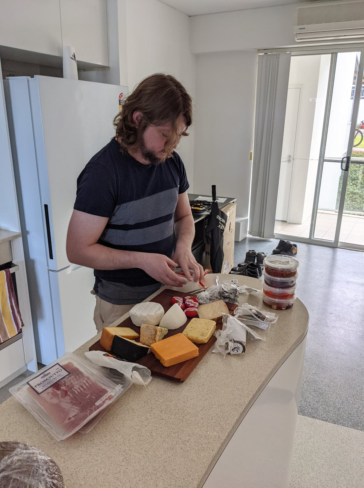

You have been an amazing person to be with, there is no one else in the world 
who is as fantastic and wonderful as you. I easily get lost staring at your face
after hard days. I can't wait to spend more of my life with you and eventually 
start our very own family. My love is with you always, and I will support you 
with anything, I will do what ever I can to help you through hard times. You are
the love of my life and you are my future. 

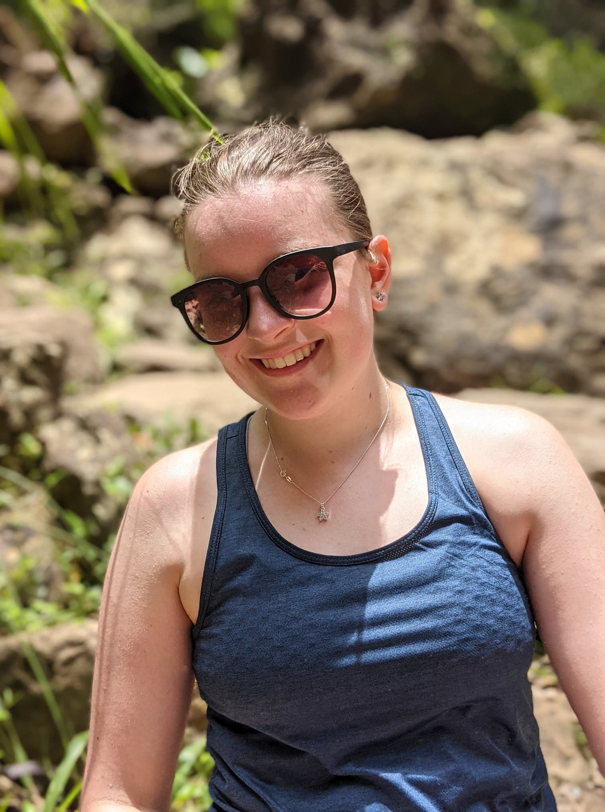

## 2021

> To be continued, let's see where our next adventure takes us.